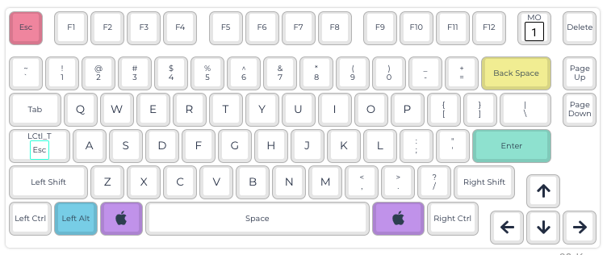
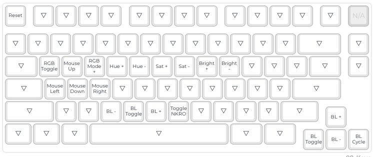

## ID80 Configurations

This is the QMK Configurator `keymap.json` file I use for the [IDOBAO ID80 75% keyboard](https://www.idobao.net/products/idobao-id80-75-hot-swappable-mechanical-keyboard-kit).

The `keymap.json` creates the layout below.  Some notes:

* The "capslock" key is a special combination key. It's `left control` when held, but `escape` when pressed.  This lets me use programs like `vim` without needing to reach up to hit the actual escape key.
* The `MO(1)` key at the top right uses `Layer 1` keys when held down.  This lets me use `WASD` to move the mouse pointer in a pinch.  `Layer 1` also contains a few other helps, including the QMK `reset` button.

### Layer 1

### Layer 2

